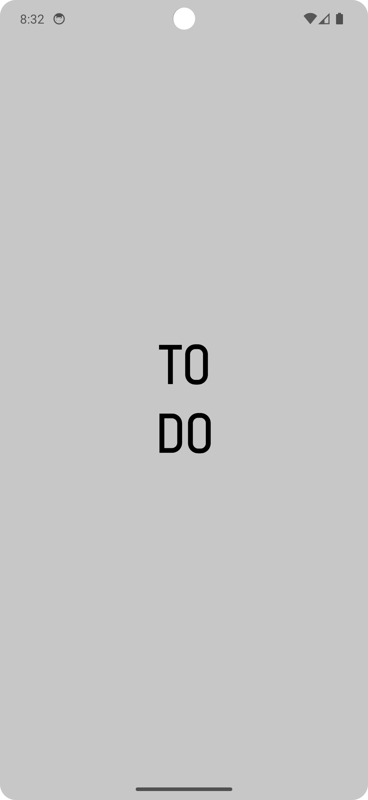
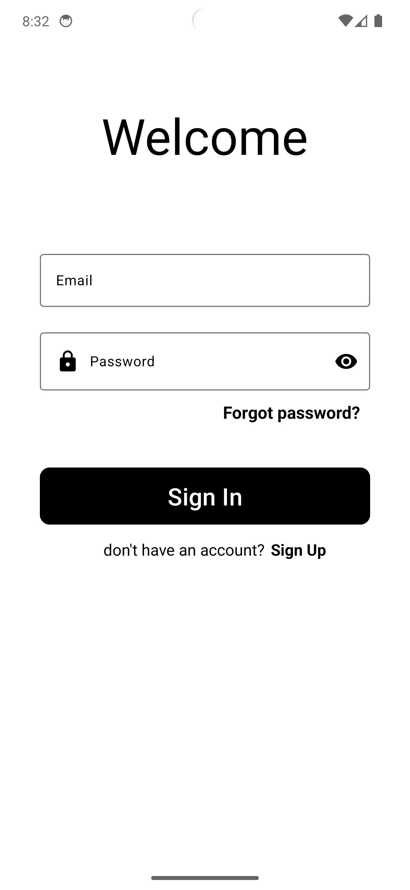
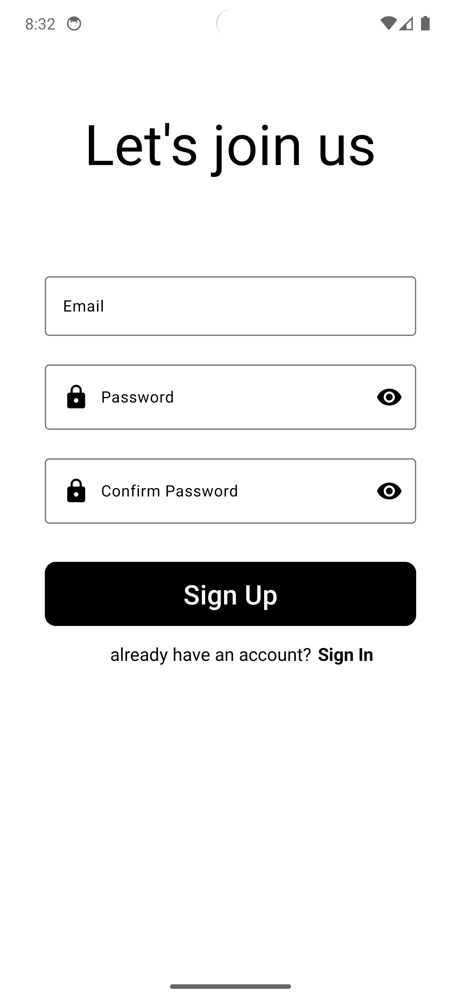
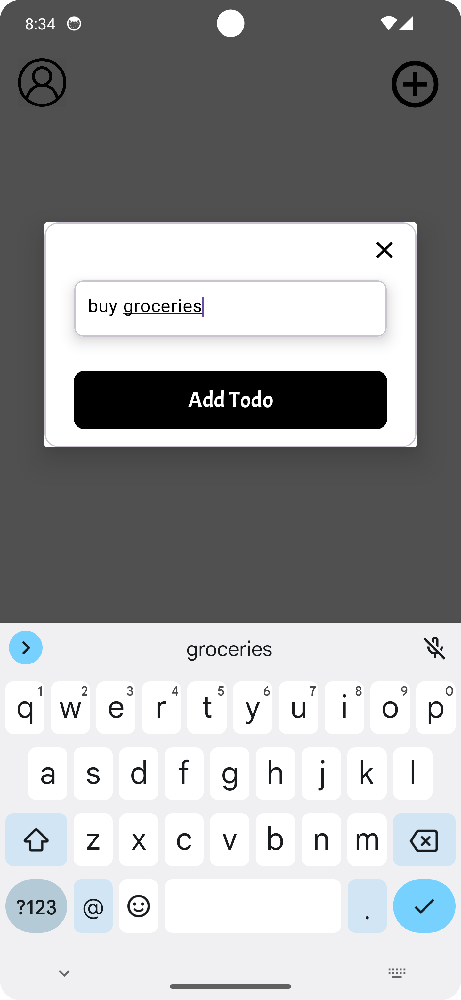
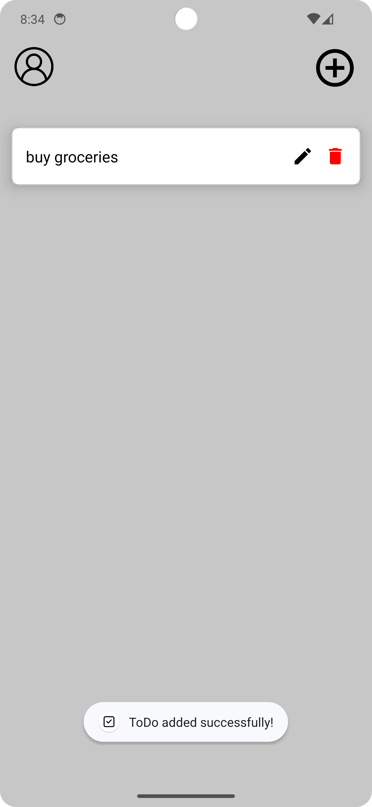
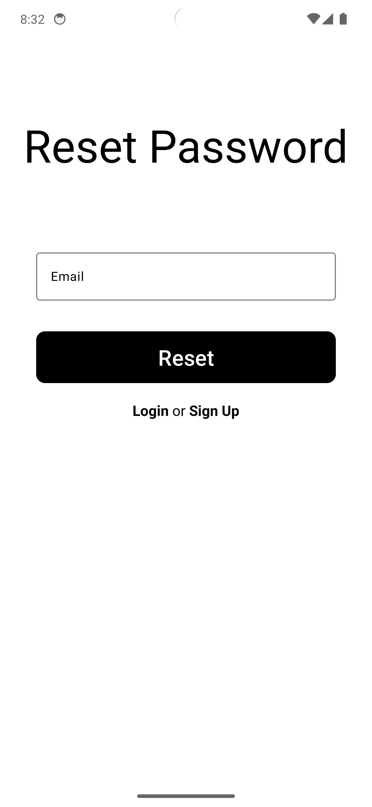
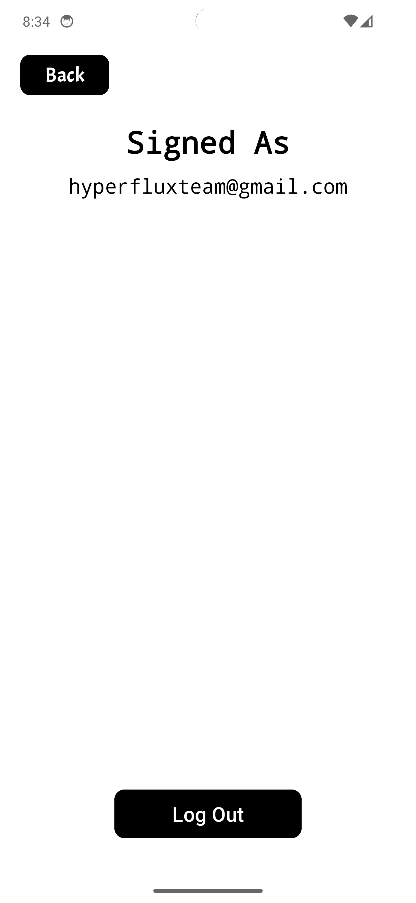

# ToDo

## Description

ToDo is a lightweight task management app designed and developed programmatically. Seamlessly manage your to-dos with ease using this powerful yet simple app. It utilizes Firebase for real-time synchronization, ensuring that your tasks are always up to date across devices.

## Usage

1. **Sign In**: Use your credentials to sign in to your account.
2. **Sign Up**: If you're new, create an account to start using the app.
3. **Add Task**: Easily add new tasks to your to-do list.
4. **Manage Tasks**: Edit or Delete.
5. **Logout**: Sign out from your account when done.

## Installation

1. Clone the repository to your local machine using Git:
   ```
   git clone https://github.com/DaviDM2005/ToDo.git
   ```

2. Open Android Studio and select "Open an Existing Project".
3. Navigate to the directory where you cloned the repository and select the "ToDo" folder.
4. Once the project is open in Android Studio, connect your device or start an emulator.
5. Click on the green play button in the toolbar to build and run the app on your device or emulator.

## APK Download

You can download the APK file [here](https://drive.google.com/file/d/1uqoz2LQG2wt0WQzwQp29Ek7Cx55dxMhE/view?usp=sharing).

## License

This project is licensed under the [GNU General Public License](LICENSE).

## Credits

This app was developed by Davit M.

## Screenshots

  

 

 
